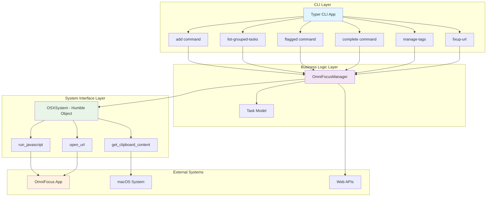
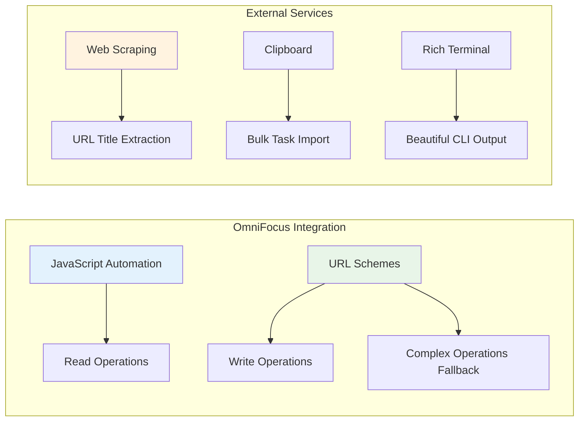
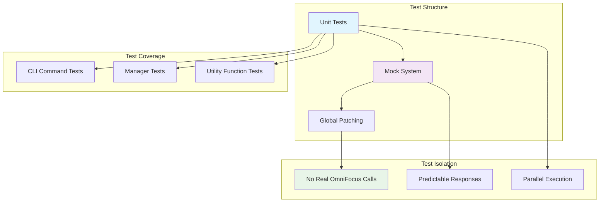
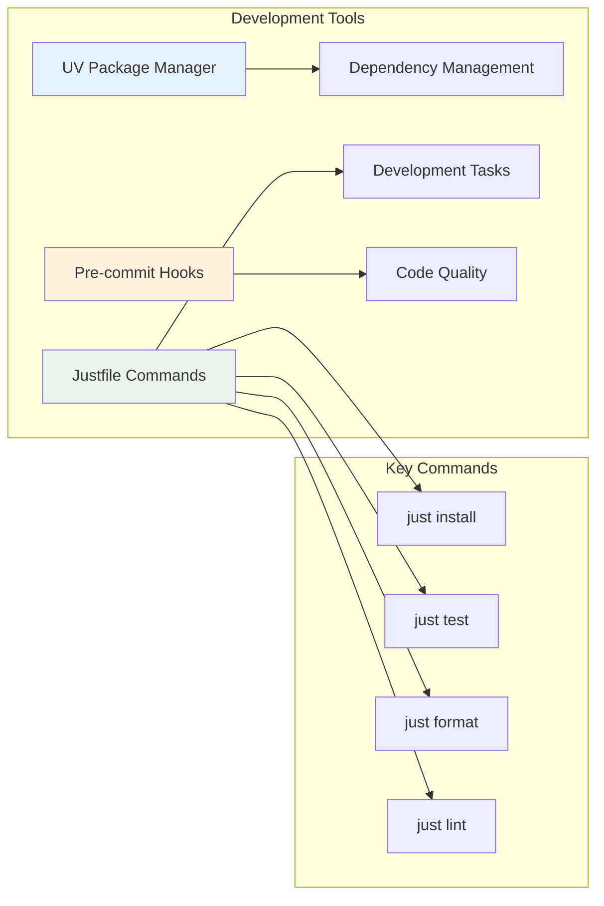
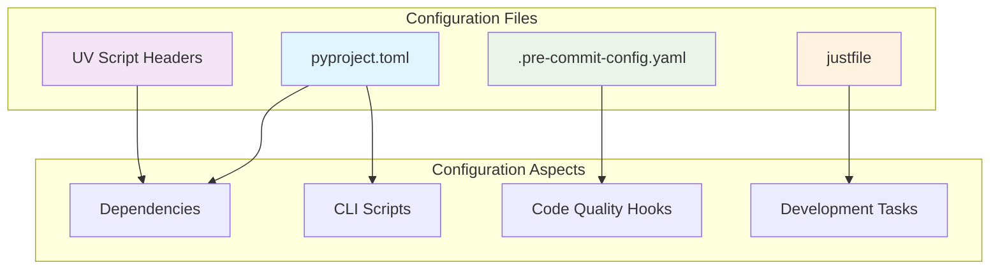

# OmniFocus CLI Architecture

This document describes the architecture and design patterns used in the OmniFocus CLI project.

## Overview

The OmniFocus CLI follows a clean architecture pattern with clear separation of concerns, using the Humble Object pattern for testability and dependency injection for flexibility.

## System Architecture



## Core Components

### 1. Data Models (Pydantic)

The `Task` model represents the core data structure:

```python
class Task(BaseModel):
    name: str
    project: str = "No Project"
    flagged: bool = False
    tags: List[str] = Field(default_factory=list)
    due_date: Optional[datetime] = None
    defer_date: Optional[datetime] = None
    estimated_minutes: Optional[int] = None
    completed: bool = False
    creation_date: Optional[datetime] = None
    id: Optional[str] = None
    note: Optional[str] = None
```

### 2. Humble Object Pattern

The `OSXSystem` class isolates all external system dependencies:

```python
class OSXSystem:
    """Humble object for OSX system operations."""

    @staticmethod
    def run_javascript(script: str) -> str:
        """Run a JavaScript script using osascript."""

    @staticmethod
    def open_url(url: str) -> None:
        """Open a URL using the open command."""

    @staticmethod
    def get_clipboard_content() -> str:
        """Get content from clipboard."""
```

### 3. Business Logic Manager

The `OmniFocusManager` contains all business logic and uses dependency injection:

```python
class OmniFocusManager:
    def __init__(self, system: OSXSystem):
        self.system = system  # Dependency injection
```

## Integration Strategies



### OmniFocus Integration Methods

1. **JavaScript Automation** (Primary for reading)

   - Used for: `get_all_tasks()`, `get_flagged_tasks()`, `get_inbox_tasks()`
   - Executes JavaScript via `osascript`
   - Returns JSON data parsed into Pydantic models

2. **URL Schemes** (Primary for writing)

   - Used for: `add_task()`, task modifications
   - Constructs URLs like: `omnifocus:///add?name=Task&project=today`
   - Handles URL encoding for special characters

3. **Hybrid Approach** (Complex operations)
   - Tag management uses URL schemes as fallback
   - Creates new tasks and completes old ones for modifications

## Testing Architecture



### Testing Strategy

- **Complete Isolation**: All external dependencies are mocked
- **Dependency Injection**: Makes testing straightforward
- **Comprehensive Coverage**: 717 lines of tests covering all major functionality
- **Parallel Execution**: Tests can run in parallel using pytest-xdist

## Development Workflow



## Design Patterns

### 1. Humble Object Pattern

- **Purpose**: Isolate external dependencies for testability
- **Implementation**: `OSXSystem` class contains all system calls
- **Benefits**: Complete test isolation, no real system interactions during testing

### 2. Dependency Injection

- **Purpose**: Flexible component composition
- **Implementation**: `OmniFocusManager` receives `OSXSystem` instance
- **Benefits**: Easy mocking, configurable behavior

### 3. Command Pattern

- **Purpose**: Encapsulate CLI operations
- **Implementation**: Each Typer command is a separate function
- **Benefits**: Clear separation of concerns, easy to extend

### 4. Factory Pattern

- **Purpose**: Create Task objects from various sources
- **Implementation**: Task creation from JSON, clipboard, URLs
- **Benefits**: Consistent object creation, validation

### 5. Strategy Pattern

- **Purpose**: Multiple integration approaches
- **Implementation**: JavaScript vs URL schemes for different operations
- **Benefits**: Fallback mechanisms, operation-specific optimization

## Configuration Management



## Error Handling Strategy

- **Graceful Fallbacks**: URL schemes as fallback for JavaScript failures
- **Input Validation**: Pydantic models ensure data integrity
- **User-Friendly Messages**: Rich formatting for error display
- **Robust Parsing**: Handles malformed clipboard content gracefully

## Performance Considerations

- **Lazy Loading**: Tasks loaded only when needed
- **Batch Operations**: Clipboard import processes multiple tasks efficiently
- **Caching**: Minimal API calls through strategic data fetching
- **Parallel Testing**: Test suite designed for parallel execution

## Security Considerations

- **Input Sanitization**: All user input is properly escaped for URL schemes
- **No Credential Storage**: Uses macOS system authentication
- **Safe JavaScript Execution**: Controlled script execution via osascript
- **URL Validation**: Proper validation of web URLs before fetching

## Future Architecture Considerations

- **Plugin System**: Could extend with plugin architecture for new integrations
- **Configuration Files**: Could add user configuration for defaults
- **Async Operations**: Could benefit from async operations for web requests
- **Database Layer**: Could add local caching/database for offline operations
