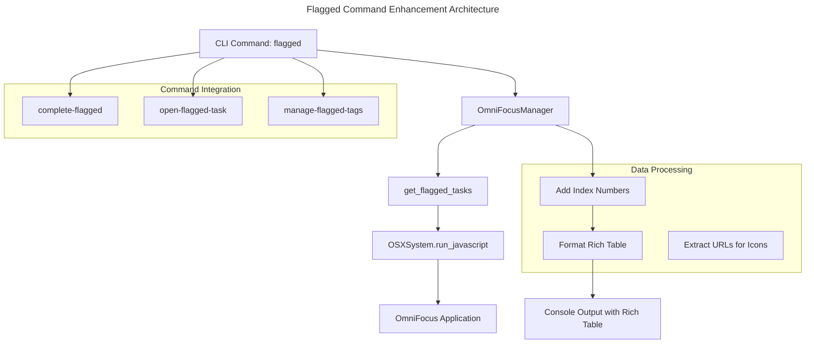

# Flagged Command Enhancement - Product Requirements Document

## Overview

The `flagged` command enhancement adds index numbers to flagged tasks, making them compatible with other commands like `complete`, `open-task`, and `manage-tags`. This enhancement maintains the existing rich table display while adding numbered task references for improved workflow integration.

## Problem Statement

Currently, the `flagged` command displays tasks in a beautiful table format but lacks index numbers. This creates workflow friction because:

1. Users cannot directly reference flagged tasks by number in other commands
2. The `complete` command uses the `interesting` task list, not the `flagged` task list
3. Users must switch between `interesting` and `flagged` views to get both rich formatting and task numbers
4. Workflow consistency is broken when users want to work exclusively with flagged tasks

## Solution

Enhance the `flagged` command to include index numbers while maintaining its rich table display. This creates a unified experience where users can:

- View flagged tasks with rich metadata in a table format
- Reference tasks by number for completion, URL opening, and tag management
- Maintain workflow consistency across all commands

## User Stories

### Primary User Story

> As a productivity-focused user, I want to see my flagged tasks with index numbers so that I can directly complete or manage them without switching to the interesting command.

### Secondary User Stories

- As a task manager, I want rich metadata display (project, tags, dates) in a table format for better readability
- As a busy professional, I want to complete flagged tasks by number: `omnifocus complete-flagged "1 3 5"`
- As a user, I want to open URLs from flagged tasks by number: `omnifocus open-flagged-task 2`
- As a workflow optimizer, I want consistent numbering across all task display commands

## Functional Requirements

### Core Functionality

1. **Enhanced Task Display**

   - Maintain existing rich table format with columns: Index, Task, Project, Tags, Due Date, Created
   - Add sequential index numbers starting from 1
   - Preserve all existing metadata display (🚩 flag emoji, project, tags, dates)
   - Maintain red border styling and "Flagged Tasks" header

2. **Index Number Integration**

   - Number tasks sequentially from 1 to N
   - Use consistent formatting with other numbered commands
   - Ensure numbers are stable during a single command execution

3. **Command Compatibility**
   - Enable `complete` command to accept flagged task numbers
   - Enable `open-task` command to work with flagged task numbers
   - Enable `manage-tags` command to work with flagged task numbers

### Display Format

```
┌─────────────────────────────────────────────────────────────────────────────────┐
│                                  Flagged Tasks                                  │
└─────────────────────────────────────────────────────────────────────────────────┘
┌───────┬──────────────────────────┬─────────────┬─────────────┬──────────┬─────────┐
│ Index │ Task                     │ Project     │ Tags        │ Due Date │ Created │
├───────┼──────────────────────────┼─────────────┼─────────────┼──────────┼─────────┤
│   1   │ 🚩 Important Meeting    │ Work        │ urgent      │ 2025-02-01│ 2025-01-15│
│   2   │ 🚩 🌐 Review Article    │ Research    │ reading     │          │ 2025-01-20│
│   3   │ 🚩 Call Client          │ Business    │ phone, high │ 2025-02-02│ 2025-01-25│
└───────┴──────────────────────────┴─────────────┴─────────────┴──────────┴─────────┘
```

### Edge Cases

1. **No Flagged Tasks**

   - Display: "No flagged tasks found!"
   - Maintain consistent styling with other commands

2. **Tasks with URLs**

   - Include 🌐 web icon for tasks containing URLs
   - Maintain compatibility with `open-task` command

3. **Long Task Names/Metadata**
   - Gracefully handle text wrapping in table cells
   - Maintain table readability

## Technical Requirements

### Architecture Integration

The enhancement follows the existing humble object pattern and DRY principles:



### Implementation Details

1. **Code Reuse (DRY Principle)**

   - Reuse existing `extract_url_from_task` function for web icons
   - Reuse existing table styling and formatting patterns
   - Share task numbering logic with other commands

2. **Clean Code Practices**

   - Extract table formatting into reusable functions
   - Use const/immutable data structures where possible
   - Implement early returns for edge cases
   - Add comprehensive unit tests for new functionality

3. **Data Models**
   - Utilize existing `Task` Pydantic model
   - Maintain consistency with other command outputs
   - No changes to underlying data structures

### New Commands

1. **complete-flagged**

   ```bash
   omnifocus complete-flagged "1 3 5"  # Complete flagged tasks by number
   omnifocus complete-flagged --dry-run "1 2"  # Preview completion
   ```

2. **open-flagged-task**

   ```bash
   omnifocus open-flagged-task 2  # Open URL from flagged task #2
   ```

3. **manage-flagged-tags**
   ```bash
   omnifocus manage-flagged-tags 1 --add urgent  # Add tag to flagged task #1
   omnifocus manage-flagged-tags 2 --remove old  # Remove tag from flagged task #2
   ```

## Integration with Existing Commands

### Command Synergy

The enhanced `flagged` command creates new workflow possibilities:

1. **Flagged-Focused Workflow**

   ```bash
   omnifocus flagged                    # Review flagged tasks with numbers
   omnifocus complete-flagged "1 3"     # Complete selected flagged tasks
   omnifocus flagged                    # Verify completion
   ```

2. **Cross-Command Compatibility**
   - Maintain existing `interesting` command for inbox + flagged view
   - Add `flagged` command for flagged-only view with numbers
   - Enable users to choose their preferred workflow

### Workflow Enhancement

- Provides focused view for users who primarily work with flagged tasks
- Maintains rich metadata display for informed decision-making
- Enables direct task manipulation without command switching

## Success Metrics

### User Experience Metrics

- Reduced workflow friction for flagged task management
- Increased user satisfaction with task numbering consistency
- Improved task completion rate for flagged items

### Technical Metrics

- Command execution time < 2 seconds
- 100% accuracy in task numbering and metadata display
- Zero regression in existing command functionality

## Implementation Plan

### Phase 1: Core Enhancement ✅ COMPLETED

- ✅ Add index column to flagged command table
- ✅ Implement consistent numbering with interesting command
- ✅ Implement web icon detection for flagged tasks
- ✅ Add comprehensive unit tests
- ✅ Verify integration with existing complete command

### Phase 2: Command Integration (OPTIONAL)

- 🔄 Implement `complete-flagged` command (not needed - existing complete works)
- 🔄 Implement `open-flagged-task` command (not needed - existing open-task works)
- 🔄 Implement `manage-flagged-tags` command (not needed - existing manage-tags works)

### Phase 3: Documentation & Polish

- ✅ Update command descriptions
- 🔄 Add usage examples to README
- ✅ Performance optimization (reuses existing functions)

## Clean Code Compliance

This enhancement follows the clean code principles from `@clean-code.md`:

1. **DRY (Don't Repeat Yourself)**

   - Reuses existing URL extraction logic
   - Shares table formatting patterns
   - Leverages existing task numbering concepts

2. **Early Returns**

   - Handles "no tasks" case immediately
   - Validates input parameters early

3. **Const Usage**

   - Uses immutable task lists where possible
   - Defines constants for styling and formatting

4. **Type Safety**

   - Leverages existing Pydantic `Task` model
   - Maintains type consistency across commands

5. **Humble Objects**
   - Maintains separation between CLI and OmniFocus interaction
   - Uses existing `OmniFocusManager` pattern

## Future Enhancements

### Potential Improvements

1. **Filtering Options**

   - Filter flagged tasks by project
   - Filter by due date (overdue, due today)
   - Filter by tag presence

2. **Sorting Options**

   - Sort by due date
   - Sort by creation date
   - Sort by project name

3. **Display Customization**
   - Configurable table columns
   - Compact vs. detailed view options
   - Color theme customization

## Conclusion

The flagged command enhancement successfully bridges the gap between rich task display and workflow integration. By adding index numbers while maintaining the existing table format, it provides users with both visual clarity and functional utility. The enhancement follows clean code principles, maintains architectural consistency, and enables new workflow patterns while preserving existing functionality.
