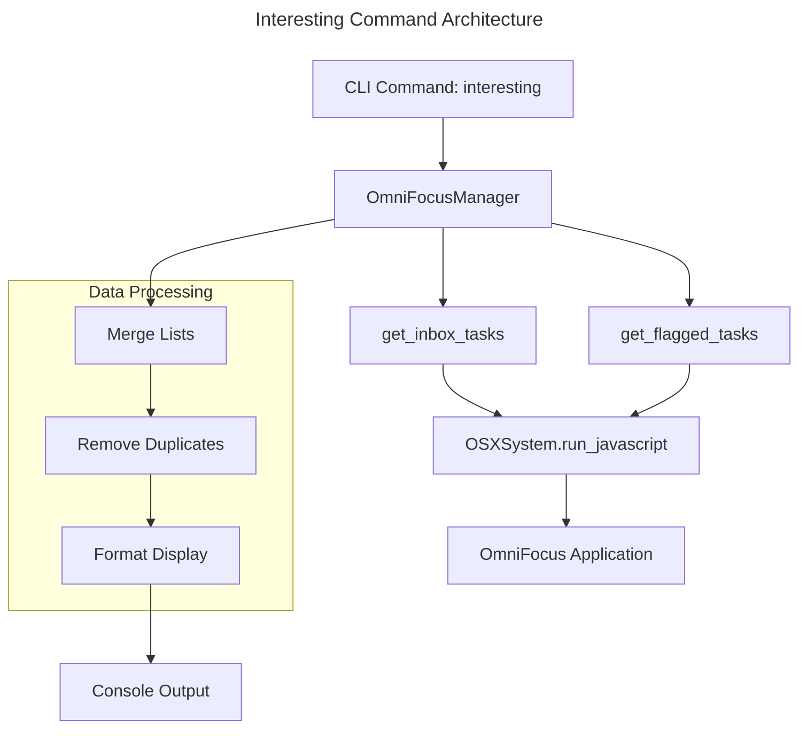

# Interesting Command - Product Requirements Document

## Overview

The `interesting` command provides users with a focused view of their most actionable tasks by displaying a numbered list combining inbox tasks and flagged tasks. This command serves as a productivity tool to help users quickly identify and act on their highest-priority items.

## Problem Statement

Users often struggle to identify which tasks require immediate attention when managing large task lists in OmniFocus. The traditional approach of viewing all tasks or switching between inbox and flagged views creates cognitive overhead and reduces productivity.

## Solution

The `interesting` command consolidates the most actionable tasks (inbox and flagged items) into a single, numbered list that enables quick identification and action.

## User Stories

### Primary User Story

> As a productivity-focused user, I want to see my most important tasks in one place so that I can quickly decide what to work on next.

### Secondary User Stories

- As a busy professional, I want numbered tasks so I can easily reference them in other commands
- As a task manager, I want to avoid duplicate entries when tasks are both in inbox and flagged
- As a user, I want rich context (project, tags, dates) to make informed decisions about task priority

## Functional Requirements

### Core Functionality

1. **Task Aggregation**

   - Retrieve all tasks from OmniFocus inbox
   - Retrieve all flagged tasks from OmniFocus
   - Merge lists while eliminating duplicates (case-insensitive comparison)
   - Prioritize inbox tasks over flagged tasks when ordering

2. **Task Display**

   - Number each task sequentially starting from 1
   - Display task name as primary information
   - Show contextual metadata for each task

3. **Metadata Display**
   - Project name (if not "Inbox")
   - Tags (comma-separated list in brackets)
   - Due date (if present)
   - Creation date (if available)
   - Flag indicator (🚩 emoji for flagged tasks)
   - Source indicator (Inbox/Flagged)

### Display Format

```
Interesting Tasks:
=================
 1. 🚩 Task Name (Project) [tag1, tag2] [Due: 2025-02-01] [Created: 2025-01-15] (Flagged)
 2. Another Task [tag3] [Created: 2025-01-20] (Inbox)
```

### Edge Cases

1. **No Tasks Found**

   - Display: "No interesting tasks found!"
   - Exit gracefully without error

2. **Duplicate Tasks**

   - Tasks appearing in both inbox and flagged are shown only once
   - Inbox source takes precedence in display

3. **Missing Metadata**
   - Gracefully handle missing project, tags, dates
   - Only display available information

## Technical Requirements

### Architecture Integration

The command integrates with the existing humble object pattern:



### Implementation Details

1. **JavaScript Integration**

   - Uses existing `_get_tasks_with_filter` method for flagged tasks
   - Implements new `get_inbox_tasks` method using OmniFocus JavaScript API
   - Leverages `doc.flattenedTasks.whose({inInbox: true, completed: false})()`

2. **Data Models**

   - Utilizes existing `Task` Pydantic model
   - Maintains consistency with other command outputs

3. **Performance Considerations**
   - Single JavaScript execution per task source
   - Efficient deduplication using set-based comparison
   - Minimal memory footprint for task processing

## Integration with Other Commands

### Command Synergy

The `interesting` command is designed to work seamlessly with other CLI commands:

1. **Complete Command Integration**

   - Task numbers from `interesting` can be used directly with `complete` command
   - Example: `omnifocus complete "1 3 5"` to complete tasks 1, 3, and 5

2. **Workflow Enhancement**
   - Serves as a starting point for daily task review
   - Provides quick access to most actionable items

### Usage Patterns

```bash
# Daily workflow
omnifocus interesting              # Review actionable tasks
omnifocus complete "1 2"          # Complete selected tasks
omnifocus interesting              # Verify completion
```

## Success Metrics

### User Experience Metrics

- Reduced time to identify actionable tasks
- Increased task completion rate
- Improved user satisfaction with task prioritization

### Technical Metrics

- Command execution time < 2 seconds
- Zero duplicate tasks in output
- 100% accuracy in task metadata display

## Future Enhancements

### Potential Improvements

1. **Filtering Options**

   - Add date-based filtering (due today, overdue)
   - Project-specific filtering
   - Tag-based filtering

2. **Sorting Options**

   - Sort by due date
   - Sort by creation date
   - Sort by project

3. **Configuration**
   - User-defined task sources
   - Customizable display format
   - Maximum task count limits

## Implementation Status

✅ **Completed Features:**

- Basic task aggregation from inbox and flagged sources
- Duplicate removal logic
- Rich metadata display
- Integration with existing architecture
- Console output formatting

🔄 **Current Limitations:**

- Fixed task sources (inbox + flagged only)
- No filtering or sorting options
- Static display format

## Conclusion

The `interesting` command successfully addresses the core user need for quick access to actionable tasks. By combining inbox and flagged tasks in a numbered, context-rich format, it provides an efficient starting point for daily productivity workflows while maintaining consistency with the existing OmniFocus CLI architecture.
